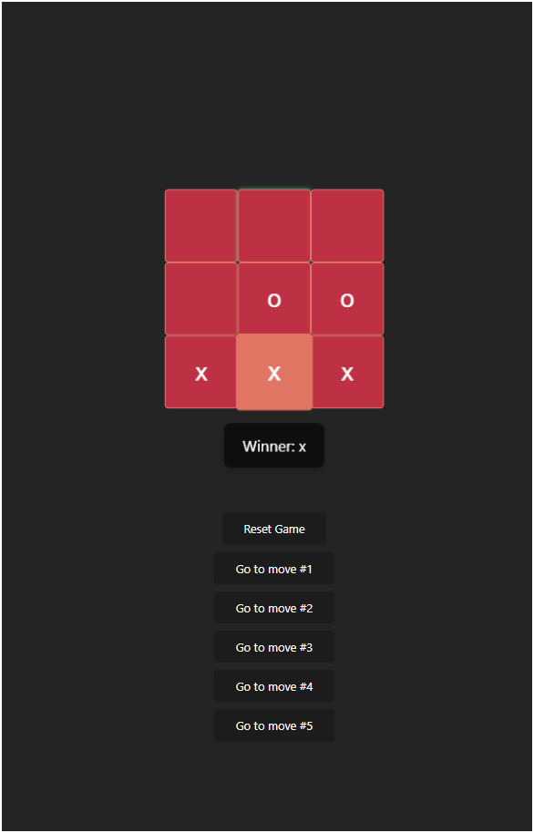
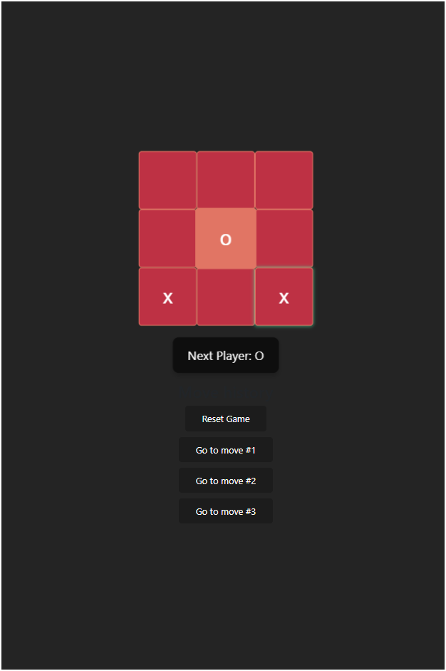

Tic-Tac-Toe Game
This is a simple Tic-Tac-Toe game built using Reactjs and Vite. The game allows two players to take turns in a 3x3 grid, marking 'X' or 'O'. The game checks for winning conditions after each move and allows the players to reset the game when it's over , and also to go back to previous moves.

Demo :  

______________________________________________________________________________________________________________________________________________________________________________________________________________________________________________________________________________________________________
Features:  
Two-player gameplay (Player 1: 'X' and Player 2: 'O'). 
Winning condition detection (horizontal, vertical, and diagonal). 
Reset button to restart the game. 
Move button to go back to previous moves. 
React-based UI with state management. 
Interactive CSS 
______________________________________________________________________________________________________________________________________________________________________________________________________________________________________________________________________________________________________

Technologies Used :  
React: A JavaScript library for building user interfaces. 
Vite: A fast build tool for modern web projects, offering fast development server and optimized builds. 
CSS: Custom styles to design the board and buttons. 
______________________________________________________________________________________________________________________________________________________________________________________________________________________________________________________________________________________________________

How to Play :  
The game board is a 3x3 grid where each square can be clicked by the players to make a move.  
Player 1 (X) and Player 2 (O) take turns. When a player clicks a square, their symbol ('X' or 'O') is placed in the square. 
The game checks if there is a winner after each move. If a player wins, their symbol is displayed on the screen. 
If all squares are filled without a winner, the game ends in a draw. 
You can reset the game anytime by clicking the "Reset Game" button. 
______________________________________________________________________________________________________________________________________________________________________________________________________________________________________________________________________________________________________

Game Logic: 
The game checks for the winner using these win conditions: 
Horizontal: [0, 1, 2], [3, 4, 5], [6, 7, 8] 
Vertical: [0, 3, 6], [1, 4, 7], [2, 5, 8] 
Diagonal: [0, 4, 8], [2, 4, 6] 
If a player matches one of these conditions, they win the game. Otherwise, it continues until all the squares are filled. 

______________________________________________________________________________________________________________________________________________________________________________________________________________________________________________________________________________________________________

Game Flow: 
The game starts with Player 1 (X) making the first move. 
After each move, the state is updated and checked for a winner. 
The game ends when a winner is found or when all squares are filled. Players can click the "Reset Game" button to restart.

______________________________________________________________________________________________________________________________________________________________________________________________________________________________________________________________________________________________________
